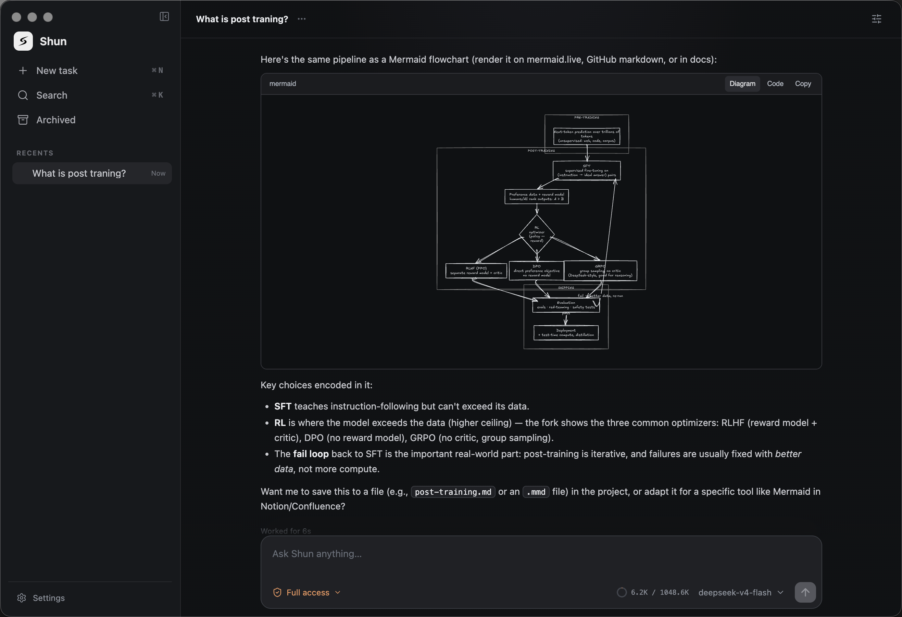

<div align="center">
  
  <h1>Shun</h1>
  <p><strong>Serious coding agents, running on hardware you own.</strong></p>
  <p><em>From intent to working software, in an instant.</em></p>
</div>

**Shun** (瞬) means *an instant* in Japanese.

The name captures what the product is for: shortening the distance between an idea and working software.

Shun is a desktop coding harness for capable models running on consumer GPUs. It provides durable context, real tools, parallel tasks, explicit permissions, background processes, and a calm interface built for long sessions.

Our goal is to build the best coding harness for any model that fits on a consumer GPU.

<p align="center">
  
</p>

## Built for local models

### Work close to your code

Run models close to your code and data without giving up repository access, web research, MCP tools, structured execution, or rich output.

### Keep tasks independent

Every task keeps its own history, draft, approvals, execution state, and active run. Work can continue in the background without hijacking the conversation in front of you.

### Keep long-running processes visible

Development servers and other long-running programs are treated as durable resources. Shun tracks their state, logs, endpoints, and ownership across tasks and application restarts.

## What Shun brings together

- Independent, concurrent coding tasks
- Persistent conversations and resumable work
- Explicit workspace and tool permissions
- Background process supervision
- Web research and MCP connectivity
- Change review based on the filesystem
- Rich Markdown, code, tables, and interactive diagrams
- A compact desktop interface designed for focus

## Run locally

Shun currently targets macOS. Development requires Node.js 22 or later and pnpm 10.

```bash
pnpm install
pnpm dev
```
