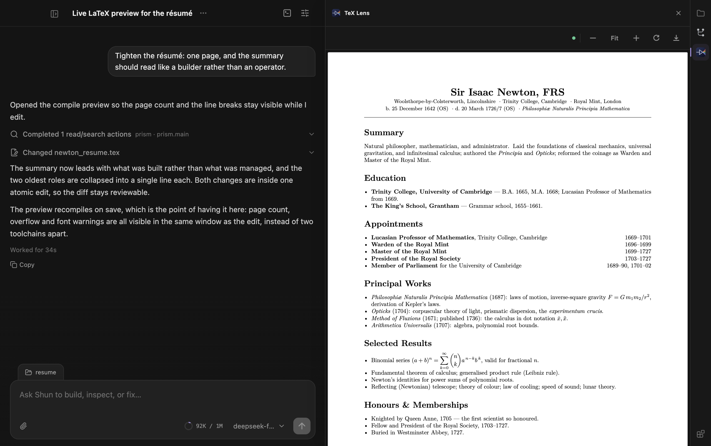
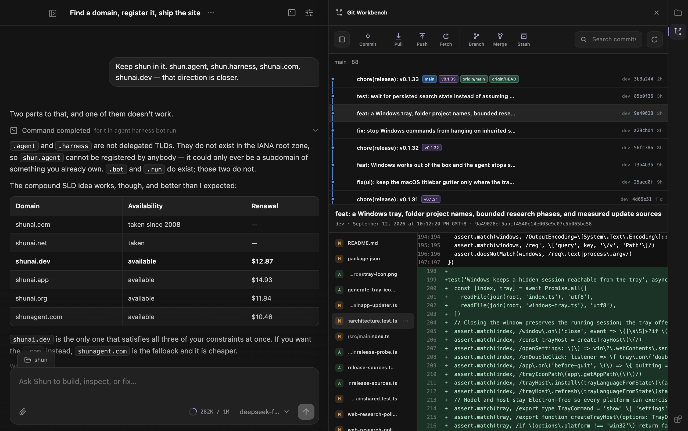

<div align="center">
  
  <h1>Shun</h1>
  <p><strong>Serious coding agents, running on hardware you own.</strong></p>
  <p><em>From intent to working software, in an instant.</em></p>
  <p>
    <a href="https://shunagent.com"></a>
    <a href="LICENSE"></a>
  </p>
</div>

**Shun** (瞬) means *an instant* in Japanese.

The name captures what the product is for: shortening the distance between an idea and working software.

Shun is a **local-first** desktop coding harness for capable models running on consumer GPUs. It is built for the models you can actually run, on the machine in front of you — and it is built so that a small model gets a serious harness instead of a demo.

It runs on your hardware, keeps your work there, and reports to nobody. There is no telemetry, no account to sign into, and no service of ours in the loop. The only network traffic Shun produces is what you configure: your model provider, and update checks you can point at your own mirror.

Our goal is to build the best coding harness for any model that fits on a consumer GPU.

<p align="center">
  
</p>

## Local first

### Your code stays on your machine

Put the weights on your own GPU and a task touches nothing but your disk. Transcripts, tool output, browser findings and files stay where they were written, and they stay there until you delete them.

If you do choose a hosted provider, only the results relevant to that task go to that provider, and nowhere else. Research, MCP servers and browser access are per-task capabilities that are off until a task asks for them.

Read the [Browser Use privacy policy](PRIVACY.md) for the one component that touches browsing data, and note that even it talks only over a loopback connection to the locally running app.

### Work close to your code

Run models close to your code and data without giving up repository access, web research, MCP tools, structured execution, or rich output.

### Keep tasks independent

Every task keeps its own history, draft, approvals, execution state, and active run. Work can continue in the background without hijacking the conversation in front of you.

### Keep long-running processes visible

Development servers and other long-running programs are treated as durable resources. Shun tracks their state, logs, endpoints, and ownership across tasks and application restarts.

## Small models first

A frontier model will paper over a bad harness. A small one will not — it forgets, it calls tools badly, and it loses the thread the moment the prompt fills with things it does not need. That makes it the useful test, and it is the case Shun is designed around rather than tolerates.

The work that makes a smaller model viable is mostly about spending context carefully:

- **Capability arrives on demand.** Tools and plugin capabilities a task is not using stay out of the prompt and are exposed only when searched for, so a plugin can ship twenty tools and cost nothing until one is relevant.
- **Every tool returns bounded output.** Local reads stream instead of loading a file into the transcript, and search results are bounded by construction. A tool catalogue is not allowed to spend the budget before work starts.
- **Edits are atomic.** One coherent change is one batch of replacements in one call, so a model that plans imperfectly still lands a single reviewable edit instead of a trail of half-steps.
- **Arguments are validated.** A malformed tool call comes back as a usable correction rather than a dead end a weak model cannot recover from.
- **Context is measured, not guessed.** Usage is counted against the model's real window and stays visible while a task runs.
- **Quirks stay at the adapter boundary.** Reasoning replay, thinking format and per-model compatibility are handled in provider adapters, so the loop keeps one shape across every model instead of branching on it.

## Plugins

Plugins are packages, not patches. A plugin installs, versions and uninstalls on its own, and can contribute tools, skills, and its own interface — which runs on a separate origin against an explicit RPC surface, so the kernel never renders plugin code and plugin code never reaches into the transcript.

Each plugin declares what it needs in its manifest (`workspace.read`, `workspace.git.write`, `workspace.process`), so you read the permissions before you enable it rather than discovering them at runtime. A plugin can also declare the native executables it requires, per platform and architecture.

**Shun builds plugins on its own.** A task can scaffold a package, implement it, install it, reload it, and drive its view through the production host until the flow passes — without leaving the app and without a second toolchain. Plugins under construction register from their source directory and reload in place, and they appear in the app under **Development plugins**.

<p align="center">
  
  <br />
  <em>TeX Lens ships its own native toolchain: it discovers the workspace's main <code>.tex</code> file, compiles it locally with a plugin-managed Tectonic renderer, and renders the real PDF in the panel — live, on every save.</em>
</p>

<p align="center">
  
  <br />
  <em>Git Workbench, the same host: commit graph, branch actions, and the diff for the commit in view.</em>
</p>

## Download

Download the newest version from [GitHub Releases](https://github.com/kyleslight/shun/releases/latest).

- **macOS (Apple Silicon):** download the `.dmg`, open it, and drag Shun into Applications. The app is signed with a Developer ID certificate and notarized by Apple.
- **Windows (x64):** download and run the `Shun-Setup-...-x64.exe` installer.
- **Linux (x64):** download the `.AppImage`, or install the `.deb` package on Debian and Ubuntu.

Installed builds check for updates shortly after launch and every ten minutes. When a new version is available, Shun can download it and restart into the update.

The update path does not assume that `github.com` is reachable or fast. Before downloading, Shun measures every release source — the GitHub release itself and the GitHub proxies that mirror the same paths — and uses the fastest reachable one, keeping the directly hosted copy unless a proxy is clearly faster. A failed download retries through the remaining sources, and a package that did not come from GitHub is verified against the release's published SHA-256 checksums before it can be installed. To host your own mirror, set `SHUN_UPDATE_BASE` to its asset base URL (for example `https://shunagent.com/shun`); it is preferred whenever it is competitive.

## Windows and developer tooling

Shun never installs Node, Git, or any other developer tool for you, and it never asks you to install one to keep working. It runs commands with the shell you already have:

- **Command interpreter:** Git Bash when it is installed, otherwise PowerShell 7 (`pwsh.exe`), Windows PowerShell 5.1, or `cmd.exe`. The tool description in each session states which interpreter runs your commands and how to write them for it, so PowerShell works out of the box without Git.
- **Tool discovery:** the machine's own `Path` values (registry, both the machine and user scope) are re-read before every turn and before each command, together with conventional install locations for Git, Node.js, nvm-windows, Volta, and PowerShell 7. Tooling you install while Shun is running is therefore visible to the next command — no app restart.
- **Encoding:** commands run through PowerShell set UTF-8 output encoding first, so non-ASCII output does not arrive as mojibake on systems whose console code page is not UTF-8.
- **One interpreter everywhere:** the interactive terminal, background processes, and foreground commands all use that same resolved shell, so a command you paste into the terminal also works when the agent runs it.
- **Background session:** closing the window keeps Shun running — tasks, background processes, and scheduled work continue — and the tray icon reopens the window, opens settings, or quits completely.

Because nothing is installed for you, a tool that is unpacked without being added to `Path` (for example a manually extracted Node.js archive) stays invisible until you add it yourself or select a project-scoped environment such as `.venv` or `node_modules/.bin`.

## Browser Use

The optional Browser Use plugin works with the user's existing Chrome tabs and signed-in state. While its Chrome Web Store release is paused, use Shun's one-time **Set up Chrome** flow to load the bundled extension from a stable per-user folder. See the [installation guide](docs/browser-use-installation.md) and [privacy policy](PRIVACY.md).

## What Shun brings together

- Independent, concurrent coding tasks
- Persistent conversations and resumable work
- Explicit workspace and tool permissions
- Background process supervision
- Web research and MCP connectivity
- Change review based on the filesystem
- Rich Markdown, code, tables, and interactive diagrams
- A compact desktop interface designed for focus

## Run locally

Shun currently targets macOS. Development requires Node.js 22 or later and pnpm 9.15 or later.

```bash
pnpm install
pnpm dev
```

## License

MIT — see [LICENSE](LICENSE).
